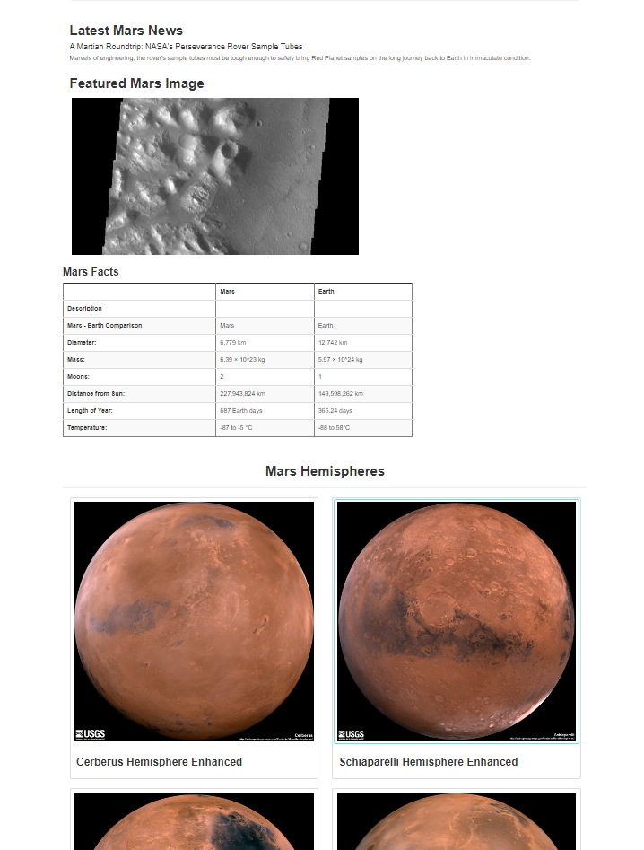

# Mission-to-Mars
Building a web application that enables up-to-date display of News articles and images of Mars via Web Scraping with HTML / CSS. 

## Background

A junior data scientist, Robin, does freelance astronomy work in her spare time.  
Her dream is to land a position with NASA someday. So she spends a lot of time visiting sites with news about space exploration, especially the mission to Mars.  

One day, while reading an article about how much water the red planet may have had in its youth, she has an idea, 
what if she can write a script that would gather all the information she searches for into one convenient location, and once she gathered it, what if she can show it off to other Astrophiles. If it’s polished enough, it may even get NASA’s attention.  

Robin, has requested our help to gather data about the mission to Mars from all over the web and display it in a central location without spending her free time gathering the data manually.  

Instead, she has requested we build a web application: (ROBIN’S MARS DATABASE: Updates | Current Martian Weather | Water Info | Rover Locations), that will scrape new data every time she tells it to, with a click of a button. 

Futhermore, the client wishes to to add more polish to the app especially since she has been admiring images of Mars’s hemispheres online and realized that the site is scraping-friendly. She would like us to adjust the current stage-1 web app to include all four of the hemisphere images. 

### Purpose
#### Stage 1 Analysis 
We intend to automate a web browser to visit different websites to extract data about the Mission to Mars.  
Then we will store it in a NoSQL database, and render the data in a web application created with Flask.  
The completed work will be displayed in your portfolio, which we will also create.  

#### Stage 2 Analysis 
We intend to use BeautifulSoup and Splinter to scrape full-resolution images of Mars’s hemispheres and the titles of those images, store the scraped data on a Mongo database, use a web application to display the data, and alter the design of the web app to accommodate these images.

## Objectives
1. Scrape Full-Resolution Mars Hemisphere Images and Titles
2. Update the Web App with Mars Hemisphere Images and Titles
3. Add Bootstrap 3 Components

## Resources
- Data sources:
- Software: MongoDB (1.31.2), MongoDB shell version v5.0.7, MongoDB server version: 5.0.7
- Libraries & Packeges: Splinter (0.17.0), BeautifulSoup (4.10.0), Web-Driver Manager (3.5.4), Chrome Browser (101.0.4951.41), PyMongo (4.1.1), Flask (1.1.2), Flask-PyMongo (2.3.0), html5lib (1.1), lxml (4.8.0).  
- Online Tools: [Mission to Mars GitHub Repository](https://github.com/Magzzie/Mission_to_Mars)

## Methods
Our analysis plan entailed the following: 
- Writing a Python script that can navigate the webpages to collect the right information.
- Once we had all the data, we needed a place to store it, such as a nonstructural database.  
Instead of using a SQL database with its structural rules, we would use a NoSQL database, MongoDB. Because the data pulled from the internet comes in many different forms; it’s not always in the neat and tidy tables that SQL requires.  
- Mongo was designed as a document-based database which suits ou needs a bit better since we would be downloading tables, but also paragraphs and images. 
- To put it all together in a web application of her own, we would need to use Flask.  
- Flask is a web framework that allows her to create a web application using Python and then customize it with HTML and CSS.  
- Our client had also requested we create a portfolio to showcase the projecta as she plans to add a link to her portfolio on her resume, so we would use Bootstrap to give it extra polish. 

## Results

Here is the first stage of the Mission-to-Mars webpage:  

  ||
  |-|

1. Scrape Full-Resolution Mars Hemisphere Images and Titles  
   - We successfully retrieved four full-resolution images of Mars Hemispheres  
    
      ||
      |-|
    
    - We successfully retrieved the images urls and titles:   
    
      ||
      |-|

2. Update the Web App with Mars’s Hemisphere Images and Titles:  

    - We were successful in establishing a connection between scraping scripts and the wepage, evident by the retrieval and display of the four high-resolution images on the Mission to Mars webpage when **Scrape New Data** is clicked.  
    
    
      ||
      |-|
    
3. Add Bootstrap 3 Components:

    - We changed the font style for **titles** and **captions** to bold.
    - Next, we reordered the Featured Mars Images and the Mars Fact table.
    - Futhermore, we updated the hemisphere images to display as thumbnails when hovered over with a thin blue shadow.   
    
      ||
      |-|
    
    - And we made the page mobile-responsive as demonstrated in the following image.  
    
      ||
      |-|
    

## Conclusions

[*Check **Mission To Mars HTML***](https://github.com/Magzzie/Mission_to_Mars/blob/main/templates/index.html)

--- 

